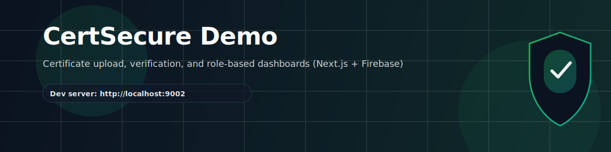
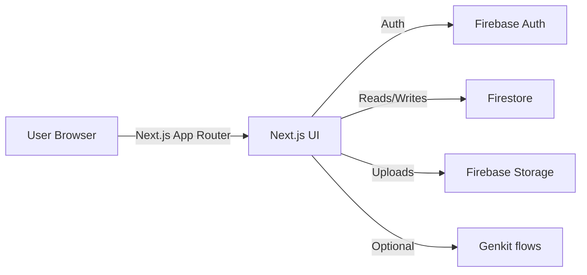

<div align="center">

[](https://nextjs.org/)
[](https://react.dev/)
[](https://firebase.google.com/)
[](https://www.typescriptlang.org/)

</div>

CertSecure Demo is a Next.js (App Router) app that showcases certificate upload + verification flows and role-based dashboards, with Firebase Auth + Firestore integration.

## Features

| Area | What you can do |
| --- | --- |
| Authentication | Email/password sign in + sign up via Firebase Auth |
| Dashboards | Admin / University / Employer / Student dashboard entry points |
| Certificate flows | Upload + verification demo UI (includes sample scenarios) |
| Rules tooling | Security rules generator flow (Genkit) |

## Quickstart

Prerequisites:

- Node.js 18+ (recommended)
- npm

Install:

```bash
npm install
```

Run (dev):

```bash
npm run dev
```

Open:

- http://localhost:9002

## Scripts

```bash
npm run dev        # Next.js dev server (Turbopack) on port 9002
npm run lint       # ESLint
npm run typecheck  # TypeScript (tsc --noEmit)
npm run build      # Production build
npm run start      # Serve the production build
```

Genkit (optional):

```bash
npm run genkit:dev
npm run genkit:watch
```

## Architecture (high level)



## Project structure

- `src/app/` — Next.js routes (App Router)
- `src/components/` — UI + feature components
- `src/firebase/` — Firebase initialization, providers, Firestore hooks
- `src/ai/` — Genkit configuration + flows
- `docs/` — blueprint + backend notes

## Firebase configuration

- Client config is in `src/firebase/config.ts`.
- In production on Firebase App Hosting, `initializeApp()` may be auto-configured via hosting-provided environment.
- In local builds, the app falls back to the config object (you may see a build-time warning during prerender; the build still succeeds).

## Troubleshooting

- Port in dev is set in `package.json` (`next dev --port 9002`). If needed, change it there.
